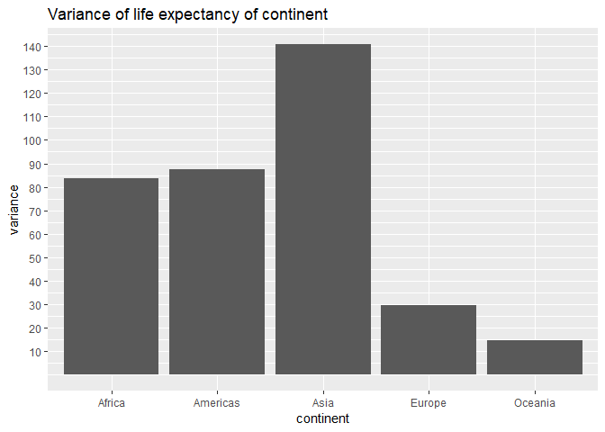
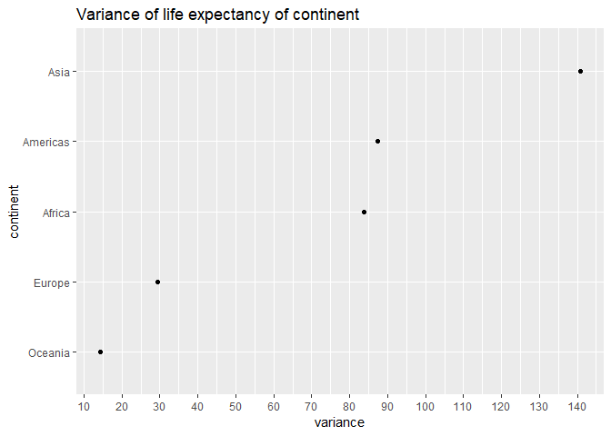
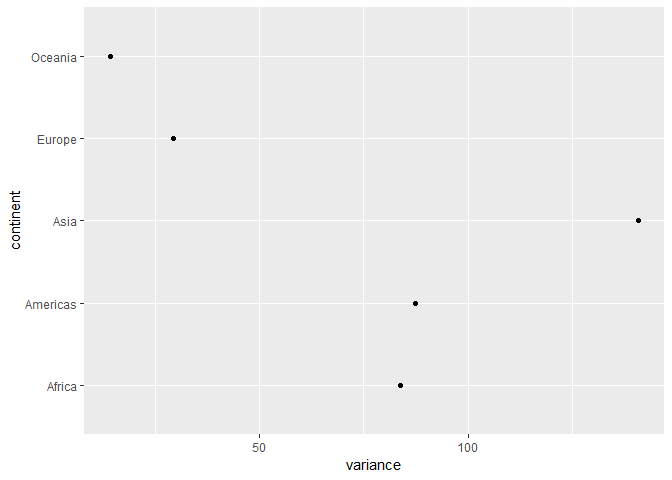

Hw-05-ChenchenGuo
================
Chenchen GUO
October 14, 2018

-   [Introduction](#introduction)

    -[Goals](#goals)
-   [Part1: Factor management](#part-1-factor-management)

    -[Requirements](#requirements)

    -[Implementation](#implementation)

-   [Part2: File I/O](#part-2-file-io)

    -[Requirements2](#requirements2)

    -[Implementation2](#implementation2)

-   [Part3: Visualization design](#part-3-visualization-design)

    -[Requirements3](#requirements3)

    -[Implementation3](#implementation3)

-   [Part4: Writing figures to file](#part-4-writing-figures-to-file)

    -[Requirements4](#requirements4)

    -[Implementation4](#implementation4)

Introduction
------------

[Homework 05](http://stat545.com/Classroom/assignments/hw05/hw05.html): Factor and figure management The aim of the homework is to have a better understanding of factor and figure management, also including the file I/O implementation and manipulating data. In this implementation, package gapminder is used.

Goals:
------

1.  Reorder a factor in a principled way based on the data and demonstrate the effect in arranged data and in figures.

2.  Write some data to file and load it back into R.

3.  Improve a figure (or make one from scratch), using new knowledge, e.g., control the color scheme, use factor levels, smoother mechanics.

4.  Make a plotly visual.

5.  Implement visulization design principles.

Part 1: Factor management
-------------------------

Requirements
------------

1.  Drop factor/levels
2.  Recorder levels based on knowledge from data
3.  Explore the effects of arrange()

Implementation
--------------

Firstly load all needed packages

``` r
suppressPackageStartupMessages(library(gapminder))
suppressPackageStartupMessages(library(ggplot2))
suppressPackageStartupMessages(library(tidyverse))
suppressPackageStartupMessages(library(knitr))
suppressPackageStartupMessages(library(kableExtra))
suppressPackageStartupMessages(library(plotly))
suppressPackageStartupMessages(library(reshape2))
```

1.  List the gapminder continent information before drop oceania

``` r
con_whole <- gapminder$continent
levels(con_whole)
```

    ## [1] "Africa"   "Americas" "Asia"     "Europe"   "Oceania"

``` r
#fct_count(con_whole)
#Form a table to show original continent information
knitr::kable(fct_count(con_whole), col.names = c('Continent', 'Number of countries')) %>% 
  kable_styling(bootstrap_options = "bordered", latex_options = "basic", full_width = F)
```

<table class="table table-bordered" style="width: auto !important; margin-left: auto; margin-right: auto;">
<thead>
<tr>
<th style="text-align:left;">
Continent
</th>
<th style="text-align:right;">
Number of countries
</th>
</tr>
</thead>
<tbody>
<tr>
<td style="text-align:left;">
Africa
</td>
<td style="text-align:right;">
624
</td>
</tr>
<tr>
<td style="text-align:left;">
Americas
</td>
<td style="text-align:right;">
300
</td>
</tr>
<tr>
<td style="text-align:left;">
Asia
</td>
<td style="text-align:right;">
396
</td>
</tr>
<tr>
<td style="text-align:left;">
Europe
</td>
<td style="text-align:right;">
360
</td>
</tr>
<tr>
<td style="text-align:left;">
Oceania
</td>
<td style="text-align:right;">
24
</td>
</tr>
</tbody>
</table>
Then use drop()

``` r
con_drop <- gapminder %>% 
  filter(continent != 'Oceania') %>% 
  droplevels()
#Indicate the number of continents after drop
levels(con_drop$continent)
```

    ## [1] "Africa"   "Americas" "Asia"     "Europe"

``` r
#Show same continents without oceania
knitr::kable(fct_count(con_drop$continent), col.names = c('Continent', 'Number of countries')) %>% 
  kable_styling(bootstrap_options = "bordered", latex_options = "basic", full_width = F)
```

<table class="table table-bordered" style="width: auto !important; margin-left: auto; margin-right: auto;">
<thead>
<tr>
<th style="text-align:left;">
Continent
</th>
<th style="text-align:right;">
Number of countries
</th>
</tr>
</thead>
<tbody>
<tr>
<td style="text-align:left;">
Africa
</td>
<td style="text-align:right;">
624
</td>
</tr>
<tr>
<td style="text-align:left;">
Americas
</td>
<td style="text-align:right;">
300
</td>
</tr>
<tr>
<td style="text-align:left;">
Asia
</td>
<td style="text-align:right;">
396
</td>
</tr>
<tr>
<td style="text-align:left;">
Europe
</td>
<td style="text-align:right;">
360
</td>
</tr>
</tbody>
</table>
1.  Reorder levels Here I will use the lifeexpectancy as a standard to level different continents. For example, use the variance of lifeExp

``` r
#Use summarize function to calculate all variance of lifeExp for all continents
var_life <- gapminder %>% 
  group_by(continent) %>% 
  summarise(variance = var(lifeExp))
#Form a table with variance and continent
knitr::kable(var_life, col.names = c('Continent', 'Variance of life expectancy')) %>% 
  kable_styling(bootstrap_options = "bordered", latex_options = "basic", full_width = F)
```

<table class="table table-bordered" style="width: auto !important; margin-left: auto; margin-right: auto;">
<thead>
<tr>
<th style="text-align:left;">
Continent
</th>
<th style="text-align:right;">
Variance of life expectancy
</th>
</tr>
</thead>
<tbody>
<tr>
<td style="text-align:left;">
Africa
</td>
<td style="text-align:right;">
83.72635
</td>
</tr>
<tr>
<td style="text-align:left;">
Americas
</td>
<td style="text-align:right;">
87.33067
</td>
</tr>
<tr>
<td style="text-align:left;">
Asia
</td>
<td style="text-align:right;">
140.76711
</td>
</tr>
<tr>
<td style="text-align:left;">
Europe
</td>
<td style="text-align:right;">
29.51942
</td>
</tr>
<tr>
<td style="text-align:left;">
Oceania
</td>
<td style="text-align:right;">
14.40666
</td>
</tr>
</tbody>
</table>
``` r
#Visulization
lifescales <- ggplot(var_life, aes(continent, variance))+
               geom_col()+
               ggtitle("Variance of life expectancy of continent")
# In order to evidently showing the number, add a scales for Y-axis
lifescales +
  scale_y_continuous(breaks = 1: 20 * 10)
```



Then use fct\_reorder() to order continents by variance of lifeExp

``` r
life_ord <- mutate(var_life, continent = fct_reorder(continent, variance))
# Visualization , this time the order of data changed from the above
ggplot(life_ord, aes(variance, continent))+
  geom_point()+
  scale_x_continuous(breaks = 1:15*10)+
  ggtitle("Variance of life expectancy of continent")
```



Now show the difference between fct\_reorder() and arrange()

``` r
# for fct_reorder list the table:
knitr::kable(life_ord, col.names = c('Continent', 'Variance of life expectancy')) %>% 
  kable_styling(bootstrap_options = "bordered", latex_options = "basic", full_width = F)
```

<table class="table table-bordered" style="width: auto !important; margin-left: auto; margin-right: auto;">
<thead>
<tr>
<th style="text-align:left;">
Continent
</th>
<th style="text-align:right;">
Variance of life expectancy
</th>
</tr>
</thead>
<tbody>
<tr>
<td style="text-align:left;">
Africa
</td>
<td style="text-align:right;">
83.72635
</td>
</tr>
<tr>
<td style="text-align:left;">
Americas
</td>
<td style="text-align:right;">
87.33067
</td>
</tr>
<tr>
<td style="text-align:left;">
Asia
</td>
<td style="text-align:right;">
140.76711
</td>
</tr>
<tr>
<td style="text-align:left;">
Europe
</td>
<td style="text-align:right;">
29.51942
</td>
</tr>
<tr>
<td style="text-align:left;">
Oceania
</td>
<td style="text-align:right;">
14.40666
</td>
</tr>
</tbody>
</table>
The data sequence in table are still the same, now use arrange()

``` r
arr_life <- var_life %>% 
  arrange(variance)
knitr::kable(arr_life, col.names = c('Continent', 'Variance of life expectancy')) %>% 
  kable_styling(bootstrap_options = "bordered", latex_options = "basic", full_width = F)
```

<table class="table table-bordered" style="width: auto !important; margin-left: auto; margin-right: auto;">
<thead>
<tr>
<th style="text-align:left;">
Continent
</th>
<th style="text-align:right;">
Variance of life expectancy
</th>
</tr>
</thead>
<tbody>
<tr>
<td style="text-align:left;">
Oceania
</td>
<td style="text-align:right;">
14.40666
</td>
</tr>
<tr>
<td style="text-align:left;">
Europe
</td>
<td style="text-align:right;">
29.51942
</td>
</tr>
<tr>
<td style="text-align:left;">
Africa
</td>
<td style="text-align:right;">
83.72635
</td>
</tr>
<tr>
<td style="text-align:left;">
Americas
</td>
<td style="text-align:right;">
87.33067
</td>
</tr>
<tr>
<td style="text-align:left;">
Asia
</td>
<td style="text-align:right;">
140.76711
</td>
</tr>
</tbody>
</table>
``` r
# Now the table of continent vs. var of life  changed order
ggplot(arr_life, aes(variance, continent))+
  geom_point()
```



``` r
#Here the arrange function only alter the sequence in table but not in figure
```

Hence, if we want to both alter the sequence on figure and table

``` r
final_life <- var_life %>% 
  mutate(continent = fct_reorder(continent, variance)) %>% 
  arrange(variance)
# visulization of both table and figure:
knitr::kable(final_life, col.names = c('Continent', 'Variance of life expectancy')) %>% 
  kable_styling(bootstrap_options = "bordered", latex_options = "basic", full_width = F)
```

<table class="table table-bordered" style="width: auto !important; margin-left: auto; margin-right: auto;">
<thead>
<tr>
<th style="text-align:left;">
Continent
</th>
<th style="text-align:right;">
Variance of life expectancy
</th>
</tr>
</thead>
<tbody>
<tr>
<td style="text-align:left;">
Oceania
</td>
<td style="text-align:right;">
14.40666
</td>
</tr>
<tr>
<td style="text-align:left;">
Europe
</td>
<td style="text-align:right;">
29.51942
</td>
</tr>
<tr>
<td style="text-align:left;">
Africa
</td>
<td style="text-align:right;">
83.72635
</td>
</tr>
<tr>
<td style="text-align:left;">
Americas
</td>
<td style="text-align:right;">
87.33067
</td>
</tr>
<tr>
<td style="text-align:left;">
Asia
</td>
<td style="text-align:right;">
140.76711
</td>
</tr>
</tbody>
</table>
``` r
ggplot(final_life, aes(variance, continent))+
  geom_point()+
  scale_x_continuous(breaks = 1:15*10)+
  ggtitle("Variance of life expectancy of continent")
```


``` r
#Now both table and figure's order in terms of variance of lifeexp are increasing
```

Part 2: File I/O
----------------

Requirements2
-------------

Experiments with one or more of write\_csv()/read\_csv(), saveRDS()/readRDS(), dput()/dget(). Make them non-alphabetical

Implementation2
---------------

Part 3: Visualization design
----------------------------

Requirements3
-------------

Use the country or continent color scheme that ships with Gapminder. Use plotly() compare with original ggplot

Implementation3
---------------

Part 4: Writing figures to file
-------------------------------

Requirements4
-------------

Use ggsave() to explicitly save a plot to file. Then load and embed in report. Play the arguments of ggsave(), such as width, height, resolution or text scaling Various graphics devices: a vector vs. raster format Explicit provision of the plot object p via ggsave(..., plot = p). showa a situation in which this actually matters.

Implementation4
---------------
