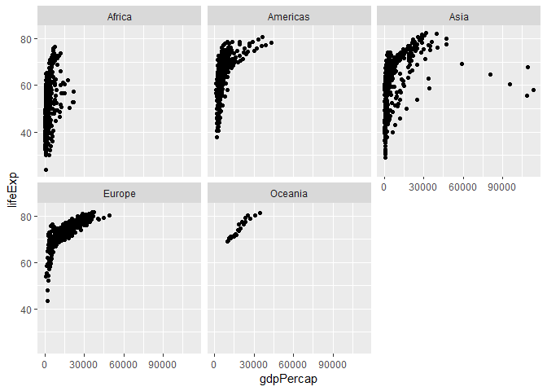
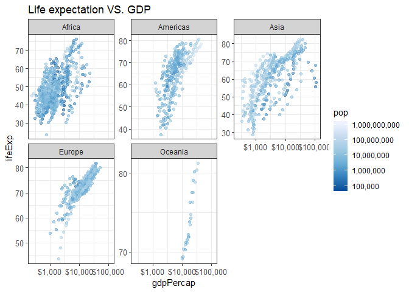
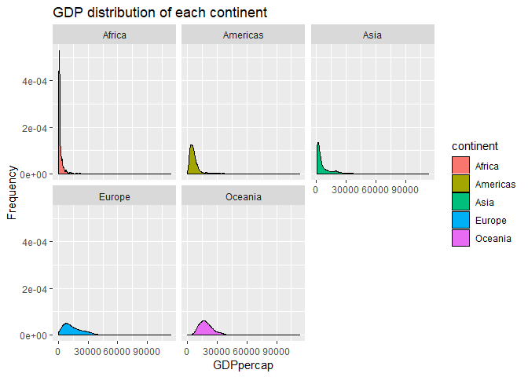
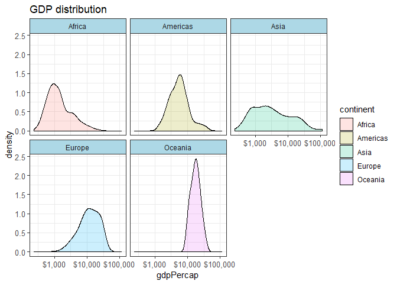

Hw-05-ChenchenGuo
================
Chenchen GUO
October 14, 2018

-   [Introduction](#introduction)

    -[Goals](#goals)
-   [Part1: Factor management](#part-1-factor-management)

    -[Requirements](#requirements)

    -[Implementation](#implementation)

-   [Part2: File I/O](#part-2-file-io)

    -[Requirements2](#requirements2)

    -[Implementation2](#implementation2)

-   [Part3: Visualization design](#part-3-visualization-design)

    -[Requirements3](#requirements3)

    -[Implementation3](#implementation3)

-   [Part4: Writing figures to file](#part-4-writing-figures-to-file)

    -[Requirements4](#requirements4)

    -[Implementation4](#implementation4)

-   [Part5: But I want to do more](#part-5-but-i-want-to-do-more)

Introduction
------------

[Homework 05](http://stat545.com/Classroom/assignments/hw05/hw05.html): Factor and figure management The aim of the homework is to have a better understanding of factor and figure management, also including the file I/O implementation and manipulating data. In this implementation, package gapminder is used.

Goals:
------

1.  Reorder a factor in a principled way based on the data and demonstrate the effect in arranged data and in figures.

2.  Write some data to file and load it back into R.

3.  Improve a figure (or make one from scratch), using new knowledge, e.g., control the color scheme, use factor levels, smoother mechanics.

4.  Make a plotly visual.

5.  Implement visulization design principles.

Part 1: Factor management
-------------------------

Requirements
------------

1.  Drop factor/levels
2.  Recorder levels based on knowledge from data
3.  Explore the effects of arrange()

Implementation
--------------

Firstly load all needed packages

``` r
suppressPackageStartupMessages(library(gapminder))
suppressPackageStartupMessages(library(ggplot2))
suppressPackageStartupMessages(library(tidyverse))
suppressPackageStartupMessages(library(knitr))
suppressPackageStartupMessages(library(kableExtra))
suppressPackageStartupMessages(library(plotly))
suppressPackageStartupMessages(library(reshape2))
suppressPackageStartupMessages(library(scales))
```

1.  List the gapminder continent information before drop oceania

``` r
con_whole <- gapminder$continent
levels(con_whole)
```

    ## [1] "Africa"   "Americas" "Asia"     "Europe"   "Oceania"

``` r
#fct_count(con_whole)
#Form a table to show original continent information
knitr::kable(fct_count(con_whole), col.names = c('Continent', 'Number of countries')) %>% 
  kable_styling(bootstrap_options = "bordered", latex_options = "basic", full_width = F)
```

<table class="table table-bordered" style="width: auto !important; margin-left: auto; margin-right: auto;">
<thead>
<tr>
<th style="text-align:left;">
Continent
</th>
<th style="text-align:right;">
Number of countries
</th>
</tr>
</thead>
<tbody>
<tr>
<td style="text-align:left;">
Africa
</td>
<td style="text-align:right;">
624
</td>
</tr>
<tr>
<td style="text-align:left;">
Americas
</td>
<td style="text-align:right;">
300
</td>
</tr>
<tr>
<td style="text-align:left;">
Asia
</td>
<td style="text-align:right;">
396
</td>
</tr>
<tr>
<td style="text-align:left;">
Europe
</td>
<td style="text-align:right;">
360
</td>
</tr>
<tr>
<td style="text-align:left;">
Oceania
</td>
<td style="text-align:right;">
24
</td>
</tr>
</tbody>
</table>
Then use drop()

``` r
con_drop <- gapminder %>% 
  filter(continent != 'Oceania') %>% 
  droplevels()
#Indicate the number of continents after drop
levels(con_drop$continent)
```

    ## [1] "Africa"   "Americas" "Asia"     "Europe"

``` r
#Show same continents without oceania
knitr::kable(fct_count(con_drop$continent), col.names = c('Continent', 'Number of countries')) %>% 
  kable_styling(bootstrap_options = "bordered", latex_options = "basic", full_width = F)
```

<table class="table table-bordered" style="width: auto !important; margin-left: auto; margin-right: auto;">
<thead>
<tr>
<th style="text-align:left;">
Continent
</th>
<th style="text-align:right;">
Number of countries
</th>
</tr>
</thead>
<tbody>
<tr>
<td style="text-align:left;">
Africa
</td>
<td style="text-align:right;">
624
</td>
</tr>
<tr>
<td style="text-align:left;">
Americas
</td>
<td style="text-align:right;">
300
</td>
</tr>
<tr>
<td style="text-align:left;">
Asia
</td>
<td style="text-align:right;">
396
</td>
</tr>
<tr>
<td style="text-align:left;">
Europe
</td>
<td style="text-align:right;">
360
</td>
</tr>
</tbody>
</table>
1.  Reorder levels Here I will use the lifeexpectancy as a standard to level different continents. For example, use the variance of lifeExp and Form a table with variance and continent

Use summarize function to calculate all variance of lifeExp for all continents

``` r
var_life <- gapminder %>% 
  group_by(continent) %>% 
  summarise(variance = var(lifeExp))

knitr::kable(var_life, col.names = c('Continent', 'Variance of life expectancy')) %>% 
  kable_styling(bootstrap_options = "bordered", latex_options = "basic", full_width = F)
```

<table class="table table-bordered" style="width: auto !important; margin-left: auto; margin-right: auto;">
<thead>
<tr>
<th style="text-align:left;">
Continent
</th>
<th style="text-align:right;">
Variance of life expectancy
</th>
</tr>
</thead>
<tbody>
<tr>
<td style="text-align:left;">
Africa
</td>
<td style="text-align:right;">
83.72635
</td>
</tr>
<tr>
<td style="text-align:left;">
Americas
</td>
<td style="text-align:right;">
87.33067
</td>
</tr>
<tr>
<td style="text-align:left;">
Asia
</td>
<td style="text-align:right;">
140.76711
</td>
</tr>
<tr>
<td style="text-align:left;">
Europe
</td>
<td style="text-align:right;">
29.51942
</td>
</tr>
<tr>
<td style="text-align:left;">
Oceania
</td>
<td style="text-align:right;">
14.40666
</td>
</tr>
</tbody>
</table>
Visulization In order to evidently showing the number, add a scales for Y-axis

``` r
lifescales <- ggplot(var_life, aes(continent, variance))+
               geom_col()+
               ggtitle("Variance of life expectancy of continent")
lifescales +
  scale_y_continuous(breaks = 1: 20 * 10)
```


Then use fct\_reorder() to order continents by variance of lifeExp Visualization , this time the order of data changed from the above

``` r
life_ord <- mutate(var_life, continent = fct_reorder(continent, variance))

ggplot(life_ord, aes(variance, continent))+
  geom_point()+
  scale_x_continuous(breaks = 1:15*10)+
  ggtitle("Variance of life expectancy of continent")
```


Now show the difference between fct\_reorder() and arrange() for fct\_reorder list the table:

``` r
knitr::kable(life_ord, col.names = c('Continent', 'Variance of life expectancy')) %>% 
  kable_styling(bootstrap_options = "bordered", latex_options = "basic", full_width = F)
```

<table class="table table-bordered" style="width: auto !important; margin-left: auto; margin-right: auto;">
<thead>
<tr>
<th style="text-align:left;">
Continent
</th>
<th style="text-align:right;">
Variance of life expectancy
</th>
</tr>
</thead>
<tbody>
<tr>
<td style="text-align:left;">
Africa
</td>
<td style="text-align:right;">
83.72635
</td>
</tr>
<tr>
<td style="text-align:left;">
Americas
</td>
<td style="text-align:right;">
87.33067
</td>
</tr>
<tr>
<td style="text-align:left;">
Asia
</td>
<td style="text-align:right;">
140.76711
</td>
</tr>
<tr>
<td style="text-align:left;">
Europe
</td>
<td style="text-align:right;">
29.51942
</td>
</tr>
<tr>
<td style="text-align:left;">
Oceania
</td>
<td style="text-align:right;">
14.40666
</td>
</tr>
</tbody>
</table>
The data sequence in table are still the same, now use arrange()

``` r
arr_life <- var_life %>% 
  arrange(variance)
knitr::kable(arr_life, col.names = c('Continent', 'Variance of life expectancy')) %>% 
  kable_styling(bootstrap_options = "bordered", latex_options = "basic", full_width = F)
```

<table class="table table-bordered" style="width: auto !important; margin-left: auto; margin-right: auto;">
<thead>
<tr>
<th style="text-align:left;">
Continent
</th>
<th style="text-align:right;">
Variance of life expectancy
</th>
</tr>
</thead>
<tbody>
<tr>
<td style="text-align:left;">
Oceania
</td>
<td style="text-align:right;">
14.40666
</td>
</tr>
<tr>
<td style="text-align:left;">
Europe
</td>
<td style="text-align:right;">
29.51942
</td>
</tr>
<tr>
<td style="text-align:left;">
Africa
</td>
<td style="text-align:right;">
83.72635
</td>
</tr>
<tr>
<td style="text-align:left;">
Americas
</td>
<td style="text-align:right;">
87.33067
</td>
</tr>
<tr>
<td style="text-align:left;">
Asia
</td>
<td style="text-align:right;">
140.76711
</td>
</tr>
</tbody>
</table>
Now the table of continent vs. var of life changed order Here the arrange function only alter the sequence in table but not in figure

``` r
ggplot(arr_life, aes(variance, continent))+
  geom_point()
```


Hence, if we want to both alter the sequence on figure and table

``` r
final_life <- var_life %>% 
  mutate(continent = fct_reorder(continent, variance)) %>% 
  arrange(variance)
```

visulization of both table and figure: Now both table and figure's order in terms of variance of lifeexp are increasing

``` r
knitr::kable(final_life, col.names = c('Continent', 'Variance of life expectancy')) %>% 
  kable_styling(bootstrap_options = "bordered", latex_options = "basic", full_width = F)
```

<table class="table table-bordered" style="width: auto !important; margin-left: auto; margin-right: auto;">
<thead>
<tr>
<th style="text-align:left;">
Continent
</th>
<th style="text-align:right;">
Variance of life expectancy
</th>
</tr>
</thead>
<tbody>
<tr>
<td style="text-align:left;">
Oceania
</td>
<td style="text-align:right;">
14.40666
</td>
</tr>
<tr>
<td style="text-align:left;">
Europe
</td>
<td style="text-align:right;">
29.51942
</td>
</tr>
<tr>
<td style="text-align:left;">
Africa
</td>
<td style="text-align:right;">
83.72635
</td>
</tr>
<tr>
<td style="text-align:left;">
Americas
</td>
<td style="text-align:right;">
87.33067
</td>
</tr>
<tr>
<td style="text-align:left;">
Asia
</td>
<td style="text-align:right;">
140.76711
</td>
</tr>
</tbody>
</table>
``` r
ggplot(final_life, aes(variance, continent))+
  geom_point()+
  scale_x_continuous(breaks = 1:15*10)+
  ggtitle("Variance of life expectancy of continent")
```


Part 2: File I/O
----------------

Requirements2
-------------

Experiments with one or more of write\_csv()/read\_csv(), saveRDS()/readRDS(), dput()/dget(). Make them non-alphabetical

Implementation2
---------------

``` r
# Firstly, use the write_csv() and read_csv() function
write.csv(arr_life, "Life_arrange.csv", append = FALSE, col.names = TRUE)
```

    ## Warning in write.csv(arr_life, "Life_arrange.csv", append = FALSE,
    ## col.names = TRUE): attempt to set 'append' ignored

    ## Warning in write.csv(arr_life, "Life_arrange.csv", append = FALSE,
    ## col.names = TRUE): attempt to set 'col.names' ignored

``` r
#Then to read from this csv file

a <- read.csv("Life_arrange.csv")
# To visualize csv file
knitr::kable(a) %>% 
  kable_styling(bootstrap_options = "bordered", latex_options = "basic", full_width = F)
```

<table class="table table-bordered" style="width: auto !important; margin-left: auto; margin-right: auto;">
<thead>
<tr>
<th style="text-align:right;">
X
</th>
<th style="text-align:left;">
continent
</th>
<th style="text-align:right;">
variance
</th>
</tr>
</thead>
<tbody>
<tr>
<td style="text-align:right;">
1
</td>
<td style="text-align:left;">
Oceania
</td>
<td style="text-align:right;">
14.40666
</td>
</tr>
<tr>
<td style="text-align:right;">
2
</td>
<td style="text-align:left;">
Europe
</td>
<td style="text-align:right;">
29.51942
</td>
</tr>
<tr>
<td style="text-align:right;">
3
</td>
<td style="text-align:left;">
Africa
</td>
<td style="text-align:right;">
83.72635
</td>
</tr>
<tr>
<td style="text-align:right;">
4
</td>
<td style="text-align:left;">
Americas
</td>
<td style="text-align:right;">
87.33067
</td>
</tr>
<tr>
<td style="text-align:right;">
5
</td>
<td style="text-align:left;">
Asia
</td>
<td style="text-align:right;">
140.76711
</td>
</tr>
</tbody>
</table>
``` r
#the str() function indicates the difference between original data frame and after writing into csv
# After writing into .csv file , there is one extra sequence column 
str(arr_life)
```

    ## Classes 'tbl_df', 'tbl' and 'data.frame':    5 obs. of  2 variables:
    ##  $ continent: Factor w/ 5 levels "Africa","Americas",..: 5 4 1 2 3
    ##  $ variance : num  14.4 29.5 83.7 87.3 140.8

``` r
str(a)
```

    ## 'data.frame':    5 obs. of  3 variables:
    ##  $ X        : int  1 2 3 4 5
    ##  $ continent: Factor w/ 5 levels "Africa","Americas",..: 5 4 1 2 3
    ##  $ variance : num  14.4 29.5 83.7 87.3 140.8

Now use saveRDS() / readRDS() function

``` r
saveRDS(arr_life, "Life_arrange.rds")
b <- readRDS("Life_arrange.rds")

# To visualize rds file
knitr::kable(b) %>% 
  kable_styling(bootstrap_options = "bordered", latex_options = "basic", full_width = F)
```

<table class="table table-bordered" style="width: auto !important; margin-left: auto; margin-right: auto;">
<thead>
<tr>
<th style="text-align:left;">
continent
</th>
<th style="text-align:right;">
variance
</th>
</tr>
</thead>
<tbody>
<tr>
<td style="text-align:left;">
Oceania
</td>
<td style="text-align:right;">
14.40666
</td>
</tr>
<tr>
<td style="text-align:left;">
Europe
</td>
<td style="text-align:right;">
29.51942
</td>
</tr>
<tr>
<td style="text-align:left;">
Africa
</td>
<td style="text-align:right;">
83.72635
</td>
</tr>
<tr>
<td style="text-align:left;">
Americas
</td>
<td style="text-align:right;">
87.33067
</td>
</tr>
<tr>
<td style="text-align:left;">
Asia
</td>
<td style="text-align:right;">
140.76711
</td>
</tr>
</tbody>
</table>
``` r
# now we see the difference between original data and after writing into .rds file
# Here, the saveRDS() function keeps the original data.
str(arr_life)
```

    ## Classes 'tbl_df', 'tbl' and 'data.frame':    5 obs. of  2 variables:
    ##  $ continent: Factor w/ 5 levels "Africa","Americas",..: 5 4 1 2 3
    ##  $ variance : num  14.4 29.5 83.7 87.3 140.8

``` r
str(b)
```

    ## Classes 'tbl_df', 'tbl' and 'data.frame':    5 obs. of  2 variables:
    ##  $ continent: Factor w/ 5 levels "Africa","Americas",..: 5 4 1 2 3
    ##  $ variance : num  14.4 29.5 83.7 87.3 140.8

Now use the dput()/ dget()

``` r
# same as before, use the arr_life data frame
dput(arr_life, "Life_arrange.R")
c <- dget("Life_arrange.R")

# To visualize the .R file
knitr::kable(c) %>% 
  kable_styling(bootstrap_options = "bordered", latex_options = "basic", full_width = F)
```

<table class="table table-bordered" style="width: auto !important; margin-left: auto; margin-right: auto;">
<thead>
<tr>
<th style="text-align:left;">
continent
</th>
<th style="text-align:right;">
variance
</th>
</tr>
</thead>
<tbody>
<tr>
<td style="text-align:left;">
Oceania
</td>
<td style="text-align:right;">
14.40666
</td>
</tr>
<tr>
<td style="text-align:left;">
Europe
</td>
<td style="text-align:right;">
29.51942
</td>
</tr>
<tr>
<td style="text-align:left;">
Africa
</td>
<td style="text-align:right;">
83.72635
</td>
</tr>
<tr>
<td style="text-align:left;">
Americas
</td>
<td style="text-align:right;">
87.33067
</td>
</tr>
<tr>
<td style="text-align:left;">
Asia
</td>
<td style="text-align:right;">
140.76711
</td>
</tr>
</tbody>
</table>
``` r
# Here, same as the saveRDS() function, the dput() function also keeps the original data.
str(arr_life)
```

    ## Classes 'tbl_df', 'tbl' and 'data.frame':    5 obs. of  2 variables:
    ##  $ continent: Factor w/ 5 levels "Africa","Americas",..: 5 4 1 2 3
    ##  $ variance : num  14.4 29.5 83.7 87.3 140.8

``` r
str(c)
```

    ## Classes 'tbl_df', 'tbl' and 'data.frame':    5 obs. of  2 variables:
    ##  $ continent: Factor w/ 5 levels "Africa","Americas",..: 5 4 1 2 3
    ##  $ variance : num  14.4 29.5 83.7 87.3 140.8

Part 3: Visualization design
----------------------------

Requirements3
-------------

Use the country or continent color scheme that ships with Gapminder. Use plotly() compare with original ggplot

Implementation3
---------------

``` r
# Firstly, the original ggplot of gapminder of different continents showing lifeExp vs. gdpPercap
p <- gapminder %>% 
  filter(continent != "Oreania") 
str(p)
```

    ## Classes 'tbl_df', 'tbl' and 'data.frame':    1704 obs. of  6 variables:
    ##  $ country  : Factor w/ 142 levels "Afghanistan",..: 1 1 1 1 1 1 1 1 1 1 ...
    ##  $ continent: Factor w/ 5 levels "Africa","Americas",..: 3 3 3 3 3 3 3 3 3 3 ...
    ##  $ year     : int  1952 1957 1962 1967 1972 1977 1982 1987 1992 1997 ...
    ##  $ lifeExp  : num  28.8 30.3 32 34 36.1 ...
    ##  $ pop      : int  8425333 9240934 10267083 11537966 13079460 14880372 12881816 13867957 16317921 22227415 ...
    ##  $ gdpPercap: num  779 821 853 836 740 ...

``` r
ggplot(p, aes(gdpPercap, lifeExp)) + 
  geom_point()+
  facet_wrap( ~ continent)
```



``` r
# This is the original figure, now we add some labels, scales and colour scheme
ggplot(p, aes(gdpPercap, lifeExp)) +
  geom_point(aes(colour = pop), alpha = 0.5) +
  scale_x_log10(labels = dollar_format()) +
  scale_color_distiller(
    trans = "log10",
    breaks = 10^(1:10),
    labels = comma_format(),
    palette = "Blues"
  )+
  scale_y_continuous(breaks = 10 * (1:10))+
  facet_wrap( ~ continent, scales = "free_y")+
   theme_bw()+
  theme(
    axis.text = element_text(size = 10),
    strip.background = element_rect(fill = "light grey"),
    panel.background = element_rect(fill = "white")
        )+
  ggtitle("Life expectation VS. GDP")
```



``` r
# Another example
# Orignal figure
gapminder %>% 
  ggplot(aes(gdpPercap, fill=continent))+
  facet_wrap(~continent)+
  geom_density()+xlab("GDPpercap")+ylab("Frequency")+
  ggtitle("GDP distribution of each continent")
```



``` r
# After design
gapminder %>% 
  ggplot(aes(gdpPercap, fill=continent)) +
  geom_density(aes(colour = pop), alpha = 0.2)+
  scale_x_log10(labels = dollar_format()) +
    scale_color_distiller(
    trans = "log10",
    breaks = 10^(1:10),
    labels = comma_format(),
    palette = "Blues"
  ) +
  facet_wrap( ~ continent)+
  ggtitle("GDP distribution")+
  theme_bw()+
  theme(
    axis.text = element_text(size = 10),
    strip.background = element_rect(fill = "light blue"),
    panel.background = element_rect(fill = "white")
        )
```



For the implementation of ploty() function

``` r
# library(plotly)
# (h <- gapminder %>% 
#   filter(continent != "Oceania") %>% 
#   ggplot(aes(gdpPercap, lifeExp))+
#   geom_point(aes(colour = pop), alpha = 0.5) +
#   scale_x_log10(labels = dollar_format()) +
#   scale_color_distiller(
#     trans = "log10",
#     breaks = 10^(1:10),
#     labels = comma_format(),
#     palette = "Blues"
#   )+
#   scale_y_continuous(breaks = 10 * (1:10))+
#   facet_wrap( ~ continent, scales = "free_y")+
#    theme_bw()+
#   theme(
#     axis.text = element_text(size = 10),
#     strip.background = element_rect(fill = "light grey"),
#     panel.background = element_rect(fill = "white")
#         )+
#   ggtitle("Life expectation VS. GDP"))
#   
# n<- ggplotly(h)
# api_create(n, filename = "r-docs-ggplotly")
```

[Ggplotly](https://plot.ly/~GChenchen/5/#/)

``` r
# m<- plot_ly(gapminder,
#         x = ~gdpPercap, 
#         y = ~lifeExp, 
#         z = ~pop,
#         type = "scatter3d",
#         mode = "markers",
#         opacity = 0.2) %>% 
#   layout(
#     scene = list(
#       xaxis = list(title = "gdpPercap"),
#       yaxis = list(title = "LifeExp"),
#       zaxis = list(title = "Population")))
# 
# api_create(m, filename = "r-docs-plotly")
```

[plotly\_3D1](https://plot.ly/~GChenchen/3/#/)

3D scattering

``` r
# o<-plot_ly(gapminder, 
#         x = ~gdpPercap, 
#         y = ~year, 
#         z = ~pop,
#         type = "scatter3d",
#         mode = "markers",
#         opacity = 0.2) %>% 
#   layout(xaxis = list(type = "log"),
#           scene = list(
#       xaxis = list(title = "gdpPercap"),
#       yaxis = list(title = "Year"),
#       zaxis = list(title = "Population")
#          ))
# 
# api_create(o, filename = "r-docs-plotly 3d2")
```

[Plotly\_3D2](https://plot.ly/~GChenchen/7/#/)

Part 4: Writing figures to file
-------------------------------

Requirements4
-------------

Use ggsave() to explicitly save a plot to file. Then load and embed in report. Play the arguments of ggsave(), such as width, height, resolution or text scaling Various graphics devices: a vector vs. raster format Explicit provision of the plot object p via ggsave(..., plot = p). showa a situation in which this actually matters.

Implementation4
---------------

Use ggsave() to save above figures separately in .png and .pdf format

``` r
figure1 <-gapminder %>% 
  ggplot(aes(gdpPercap, fill=continent)) +
  geom_density(aes(colour = pop), alpha = 0.2)+
  scale_x_log10(labels = dollar_format()) +
    scale_color_distiller(
    trans = "log10",
    breaks = 10^(1:10),
    labels = comma_format(),
    palette = "Blues"
  ) +
  facet_wrap( ~ continent)+
  ggtitle("GDP distribution")+
  theme_bw()+
  theme(
    axis.text = element_text(size = 10),
    strip.background = element_rect(fill = "light blue"),
    panel.background = element_rect(fill = "white")
        )
  
ggsave("figure1.png",
       plot = figure1,
       width = 15,
       height = 10,
       scale = 1.5)

figure2 <- gapminder %>% 
  filter(continent != "Oreania") %>% 
  ggplot(aes(gdpPercap, lifeExp)) +
  geom_point(aes(colour = pop), alpha = 0.5) +
  scale_x_log10(labels = dollar_format()) +
  scale_color_distiller(
    trans = "log10",
    breaks = 10^(1:10),
    labels = comma_format(),
    palette = "Blues"
  )+
  scale_y_continuous(breaks = 10 * (1:10))+
  facet_wrap( ~ continent, scales = "free_y")+
   theme_bw()+
  theme(
    axis.text = element_text(size = 10),
    strip.background = element_rect(fill = "light grey"),
    panel.background = element_rect(fill = "white")
        )+
  ggtitle("Life expectation VS. GDP")


ggsave("figure2.pdf",
       plot = figure2,
       width = 15,
       height = 10,
       scale = 1.5)
```

The save files will be uploaded into github

Part5: But I want to do more
----------------------------

Make a new dataframe called sport\_country

``` r
sport_country <- data.frame(
  country = c("China", "Spain", "Japan", "Malaysia", "Canada", "United States"),
  sport = c("PingPong", "Soccer", "Baseball", "Badminton", "Hockey", "Basketball")
)
country_gap <- gapminder %>% 
  filter(country %in% c("China", "Spain", "Japan", "Malaysia", "Canada", "United States")) %>% 
  droplevels()

sport_gap <- left_join(sport_country, country_gap)
```

    ## Joining, by = "country"

Now we can see the new data frame contains both from gapminder and sport\_Country

``` r
str(sport_gap)
```

    ## 'data.frame':    72 obs. of  7 variables:
    ##  $ country  : Factor w/ 6 levels "Canada","China",..: 2 2 2 2 2 2 2 2 2 2 ...
    ##  $ sport    : Factor w/ 6 levels "Badminton","Baseball",..: 5 5 5 5 5 5 5 5 5 5 ...
    ##  $ continent: Factor w/ 3 levels "Americas","Asia",..: 2 2 2 2 2 2 2 2 2 2 ...
    ##  $ year     : int  1952 1957 1962 1967 1972 1977 1982 1987 1992 1997 ...
    ##  $ lifeExp  : num  44 50.5 44.5 58.4 63.1 ...
    ##  $ pop      : int  556263527 637408000 665770000 754550000 862030000 943455000 1000281000 1084035000 1164970000 1230075000 ...
    ##  $ gdpPercap: num  400 576 488 613 677 ...

``` r
sp<- sport_gap%>% 
  summarize(
    nrow = nrow(sport_gap),
    nlevels = nlevels(sport_gap$country),
    nlevels2 = nlevels(sport_gap$sport))


knitr::kable(sp, col.names = c("Row", "Country", "Sport")) %>% 
    kable_styling(bootstrap_options = "bordered", latex_options = "basic", full_width = F)
```

<table class="table table-bordered" style="width: auto !important; margin-left: auto; margin-right: auto;">
<thead>
<tr>
<th style="text-align:right;">
Row
</th>
<th style="text-align:right;">
Country
</th>
<th style="text-align:right;">
Sport
</th>
</tr>
</thead>
<tbody>
<tr>
<td style="text-align:right;">
72
</td>
<td style="text-align:right;">
6
</td>
<td style="text-align:right;">
6
</td>
</tr>
</tbody>
</table>
To show combined data frame of year 2007

``` r
hp <- sport_gap %>% 
  filter(year == 2007)

knitr::kable(hp) %>% 
   kable_styling(bootstrap_options = "bordered", latex_options = "basic", full_width = F, position = "left")
```

<table class="table table-bordered" style="width: auto !important; ">
<thead>
<tr>
<th style="text-align:left;">
country
</th>
<th style="text-align:left;">
sport
</th>
<th style="text-align:left;">
continent
</th>
<th style="text-align:right;">
year
</th>
<th style="text-align:right;">
lifeExp
</th>
<th style="text-align:right;">
pop
</th>
<th style="text-align:right;">
gdpPercap
</th>
</tr>
</thead>
<tbody>
<tr>
<td style="text-align:left;">
China
</td>
<td style="text-align:left;">
PingPong
</td>
<td style="text-align:left;">
Asia
</td>
<td style="text-align:right;">
2007
</td>
<td style="text-align:right;">
72.961
</td>
<td style="text-align:right;">
1318683096
</td>
<td style="text-align:right;">
4959.115
</td>
</tr>
<tr>
<td style="text-align:left;">
Spain
</td>
<td style="text-align:left;">
Soccer
</td>
<td style="text-align:left;">
Europe
</td>
<td style="text-align:right;">
2007
</td>
<td style="text-align:right;">
80.941
</td>
<td style="text-align:right;">
40448191
</td>
<td style="text-align:right;">
28821.064
</td>
</tr>
<tr>
<td style="text-align:left;">
Japan
</td>
<td style="text-align:left;">
Baseball
</td>
<td style="text-align:left;">
Asia
</td>
<td style="text-align:right;">
2007
</td>
<td style="text-align:right;">
82.603
</td>
<td style="text-align:right;">
127467972
</td>
<td style="text-align:right;">
31656.068
</td>
</tr>
<tr>
<td style="text-align:left;">
Malaysia
</td>
<td style="text-align:left;">
Badminton
</td>
<td style="text-align:left;">
Asia
</td>
<td style="text-align:right;">
2007
</td>
<td style="text-align:right;">
74.241
</td>
<td style="text-align:right;">
24821286
</td>
<td style="text-align:right;">
12451.656
</td>
</tr>
<tr>
<td style="text-align:left;">
Canada
</td>
<td style="text-align:left;">
Hockey
</td>
<td style="text-align:left;">
Americas
</td>
<td style="text-align:right;">
2007
</td>
<td style="text-align:right;">
80.653
</td>
<td style="text-align:right;">
33390141
</td>
<td style="text-align:right;">
36319.235
</td>
</tr>
<tr>
<td style="text-align:left;">
United States
</td>
<td style="text-align:left;">
Basketball
</td>
<td style="text-align:left;">
Americas
</td>
<td style="text-align:right;">
2007
</td>
<td style="text-align:right;">
78.242
</td>
<td style="text-align:right;">
301139947
</td>
<td style="text-align:right;">
42951.653
</td>
</tr>
</tbody>
</table>
